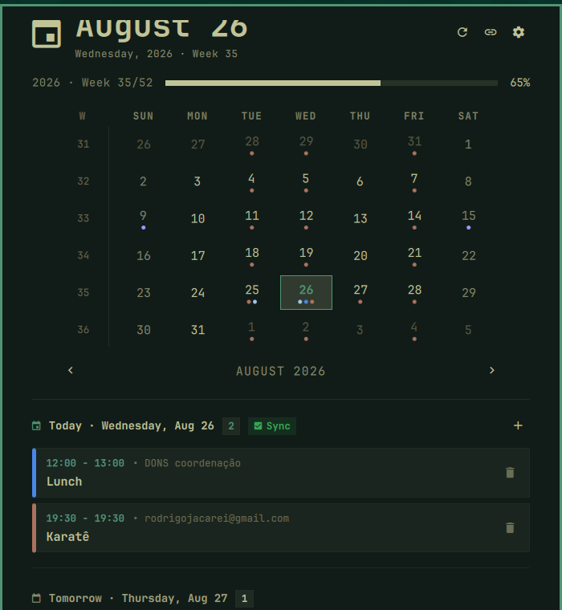

# Omarchy Clock 󰃭

A feature-rich, beautiful Clock, Calendar, Agenda, and Google Calendar Two-Way Cloud Sync plugin for **[Omarchy Linux](https://omarchy.org/)**.

Designed specifically for the Omarchy status bar and Quickshell desktop environment, following Omarchy's design language, typography, and interactive keyboard/mouse controls.

<div align="center">
  
</div>

<p align="center">
  <em>Live top-bar upcoming countdown, interactive month calendar, Google Calendar 2-Way Sync, Google Meet 1-click Join, and persistent desktop notifications.</em>
</p>

---

## ✨ Features

- **Status Bar Clock & Upcoming Event Countdown**:
  - Live clock with customizable date/time formats and vertical layout support.
  - Optional upcoming event title and time countdown displayed right beside the clock on the top bar.
  - Google Meet indicator icon (`󰕧`) for meetings with video calls.

- **Full Month Calendar & Navigation**:
  - Clean monthly date grid with ISO week numbers.
  - Dot indicators on dates with scheduled events, color-coded by calendar.
  - Jump to today with one click or hotkey (`T`).
  - Toggle week start between **Monday** and **Sunday** (`W`).
  - Fast month/year navigation via arrow buttons or keyboard shortcuts (`[` / `]` for months, `{` / `}` for years).

- **Today & Tomorrow's Agenda Schedule**:
  - Detailed daily timeline showing start/end times and calendar tags.
  - Separate, styled **Tomorrow's Schedule** section.
  - **1-Click Google Meet Join**: Events with Google Meet or video conference URLs display an interactive green **`Join`** button to open the call directly in your browser.
  - Toggle to show only upcoming events or keep past events visible.

- **Event Creation with Recurrence & Google Meet**:
  - In-panel event creator for both local and Google Cloud calendars.
  - **Recurrence Engine**: Create repeating rules (Daily, Weekly on selected days, Monthly on day of month or nth weekday, Yearly) with optional end date or occurrence limit.
  - **Generate Meeting Link**: Toggle to automatically provision a Google Meet video conference link via Google Calendar API.

- **Smart Recurring Event Deletion**:
  - When deleting repeating events, an interactive dialog offers 3 standard calendar scopes:
    - `󰄲` **This event only**: Cancels only the selected occurrence on that date.
    - `󰒭` **This and all following events**: Stops recurrence starting from this date forward.
    - `󰆴` **All events in the series**: Permanently deletes the entire recurring series.

- **Desktop Reminders & Notifications**:
  - Background notification checker monitoring upcoming meetings and events.
  - Interactive toast notifications with **`󰕧 Join Meeting`** action buttons.
  - Configurable advance reminder time: **`5 min`**, **`10 min`** *(default)*, **`15 min`**, or **`30 min`**.
  - **Stay on Screen Until Clicked (Persistent Mode)**: Keeps reminders visible until clicked or dismissed so you never miss a meeting.

- **Two-Way Google Cloud Sync (OAuth 2.0)**:
  - Direct integration with Google Calendar API v3.
  - Real-time two-way synchronization: events created, edited, or deleted in the clock update instantly on Google Cloud and your phone.
  - Multi-calendar selector and visibility filters.
  - Configurable background auto-sync frequency (**`1 min`**, **`2 min`** *(default)*, **`5 min`**, **`15 min`**).

- **Read-Only iCal / Webcal Feed Support**:
  - Subscribe to any public or private `.ics` calendar URL (Google Calendar secret address, Outlook, Apple Calendar, Fastmail).

---

## ⚡ Google Calendar Two-Way Sync Setup

You can connect your Google Calendar using either the fast CLI workflow or the Google Cloud Console web interface:

### Option A: Fast Setup via Google Workspace CLI (`gws`) / Google Cloud CLI

If you use the [Google Workspace CLI (`gws`)](https://github.com/googleworkspace/cli) or Google Cloud SDK (`gcloud`), you can provision your OAuth 2.0 Client ID directly from your terminal:

```bash
# 1. Create a project (or use existing)
gcloud projects create omarchy-calendar-sync --name="Omarchy Calendar"
gcloud config set project omarchy-calendar-sync

# 2. Enable Google Calendar API
gcloud services enable calendar-json.googleapis.com

# 3. Create OAuth Desktop credentials and export client_secret.json
gcloud iam oauth-client-ids create omarchy-clock \
  --project=omarchy-calendar-sync \
  --client-type=desktop-app \
  --description="Omarchy Clock Desktop Client"
```

Save the downloaded JSON file as `~/.config/omarchy-clock/client_secret.json`, or open the Clock Settings in your panel and paste the **Client ID** and **Client Secret**.

---

### Option B: Step-by-Step Google Cloud Console (Web GUI)

1. Go to the [Google Cloud Console](https://console.cloud.google.com/).
2. Create a new project (e.g. `Omarchy Calendar`).
3. In **APIs & Services** → **Library**, search for **Google Calendar API** and click **Enable**.
4. In **APIs & Services** → **OAuth consent screen**:
   - Select **External** (or Internal for Workspace).
   - Fill in the App name (e.g. `Omarchy Clock`) and your email.
   - Under **Scopes**, add `https://www.googleapis.com/auth/calendar`.
   - In **Test users**, add your Google email address.
5. In **APIs & Services** → **Credentials**:
   - Click **Create Credentials** → **OAuth client ID**.
   - Select **Application type**: `Desktop app`.
   - Click **Create**.
6. Open the clock panel in Omarchy, click **Settings (󰒓)** → **Configure Client ID & Secret**, and paste your credentials.
7. Click **`Connect with Google`** to sign in through your browser.

---

### Option C: Instant Read-Only Sync (Secret iCal URL)

If you only need to view events without creating/editing:
1. Open [Google Calendar](https://calendar.google.com/) in your browser.
2. Go to **Settings** → click your calendar under *Settings for my calendars*.
3. Scroll to **Integrate calendar** and copy the **Secret address in iCal format** (`https://calendar.google.com/calendar/ical/.../basic.ics`).
4. Open the clock panel, click **Settings (󰒓)** → **Add iCal Subscription URL**, and paste the URL.

---

## 📦 Installation

### Option 1: Using Omarchy CLI (Recommended)

```bash
omarchy plugin add https://github.com/rodrigojacarei/omarchy-clock.git --enable
```

### Option 2: Manual Installation / Local Development

```bash
# 1. Clone repository into Omarchy plugins directory
git clone https://github.com/rodrigojacarei/omarchy-clock.git ~/.config/omarchy/plugins/omarchy-clock

# 2. Symlink CLI helper and desktop application launcher
mkdir -p ~/.local/bin ~/.local/share/applications
ln -sf ~/.config/omarchy/plugins/omarchy-clock/bin/omarchy-clock ~/.local/bin/omarchy-clock
cp ~/.config/omarchy/plugins/omarchy-clock/omarchy-clock.desktop ~/.local/share/applications/

# 3. Reload Omarchy shell
omarchy-restart-shell
omarchy plugin enable omarchy-clock --section center
```

---

## ⌨️ Keyboard Shortcuts & Hyprland Keybindings

### In-Panel Shortcuts
| Key | Action |
| :--- | :--- |
| `[` / `]` | Previous / Next Month |
| `{` / `}` | Previous / Next Year |
| `T` | Jump to Today |
| `W` | Toggle Week Start (Monday / Sunday) |
| `N` / `+` | Open Add Event Drawer |
| `S` | Open Settings & Calendars View |
| `Esc` | Close Drawer / Dismiss Popup |

### Hyprland Keybindings (Optional)
Add to your `~/.config/hypr/bindings.conf`:

```ini
# Toggle Clock & Calendar popup
bind = SUPER, C, exec, omarchy-clock toggle
```

---

## 🛠️ CLI Commands

```bash
omarchy-clock toggle         # Open or close the Calendar panel
omarchy-clock open           # Open the panel
omarchy-clock close          # Close the panel
omarchy-clock sync           # Trigger immediate background sync
omarchy-clock status         # Check Google Cloud OAuth status
omarchy-clock auth           # Run Google Cloud authentication flow
omarchy-clock logout         # Disconnect Google Cloud account
```

---

## 📄 License

MIT License. See [LICENSE](LICENSE) for details.

Developed with ❤️ by **[rodrigojacarei](https://github.com/rodrigojacarei)** for the Omarchy Linux community.
